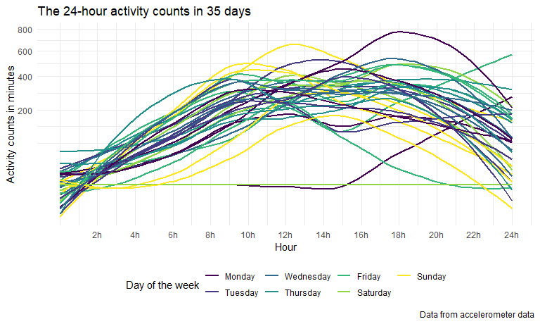
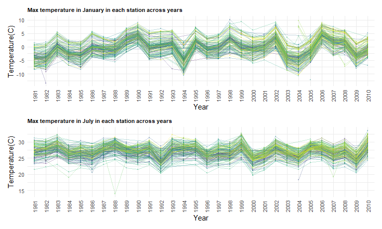
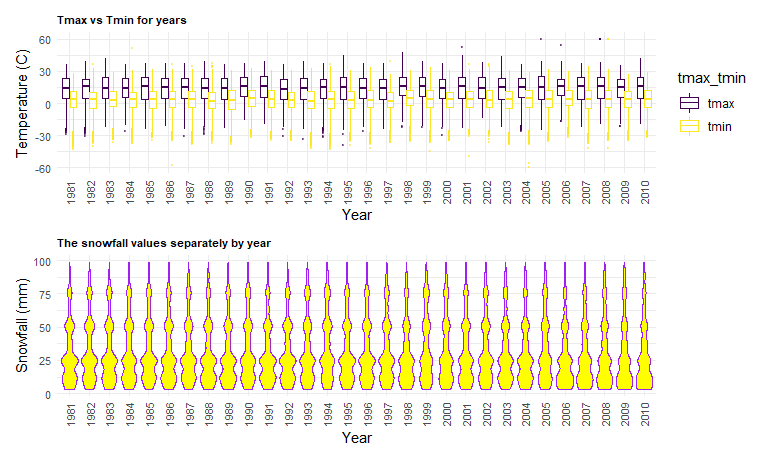

p8105\_hw3\_lg3156
================
Liner Ge
2020/10/7

``` r
library(tidyverse)
```

    ## -- Attaching packages ----------------------------- tidyverse 1.3.0 --

    ## √ ggplot2 3.3.2     √ purrr   0.3.4
    ## √ tibble  3.0.3     √ dplyr   1.0.2
    ## √ tidyr   1.1.2     √ stringr 1.4.0
    ## √ readr   1.3.1     √ forcats 0.5.0

    ## -- Conflicts -------------------------------- tidyverse_conflicts() --
    ## x dplyr::filter() masks stats::filter()
    ## x dplyr::lag()    masks stats::lag()

``` r
library(p8105.datasets)
library(readxl)
library(dplyr)
library(rnoaa)
```

    ## Registered S3 method overwritten by 'hoardr':
    ##   method           from
    ##   print.cache_info httr

``` r
library(ggridges)
library(patchwork)

knitr::opts_chunk$set(
  fig.height = 8,
  fig.width = 8,
  fig.asp = .6,
  out.width = "90%"
)

theme_set(theme_minimal() + theme(legend.position = "bottom"))

options(
  ggplot2.continuous.colour = "viridis",
  ggplot2.continuous.fill = "viridis"
)

scale_colour_discrete = scale_colour_viridis_d
scale_fill_discrete = scale_fill_viridis_d
```

# Problem 1

``` r
data("instacart")
```

This dataset contains 1384617 rows and 15 columns.

Observations are the level of items in orders by user. There are user /
order variables – user ID, order ID, order day, and order hour. There
are also item variables – name, aisle, department, and some numeric
codes.

### How many aisles, and which are most items from?

``` r
instacart %>% 
  count(aisle) %>% 
  arrange(desc(n))
```

    ## # A tibble: 134 x 2
    ##    aisle                              n
    ##    <chr>                          <int>
    ##  1 fresh vegetables              150609
    ##  2 fresh fruits                  150473
    ##  3 packaged vegetables fruits     78493
    ##  4 yogurt                         55240
    ##  5 packaged cheese                41699
    ##  6 water seltzer sparkling water  36617
    ##  7 milk                           32644
    ##  8 chips pretzels                 31269
    ##  9 soy lactosefree                26240
    ## 10 bread                          23635
    ## # ... with 124 more rows

There are 134 aisles and most items from fresh vegetables.

### Make a plot

``` r
instacart %>% 
  count(aisle) %>% 
  filter(n > 10000) %>% 
  mutate(
    aisle = factor(aisle),
    aisle = fct_reorder(aisle, n)
  ) %>% 
  ggplot(aes(x = aisle, y = n)) +
  geom_point() +
  theme(axis.text.x = element_text(angle = 90, vjust = 0.5, hjust = 1))
```


### Make a table

``` r
instacart %>%
  filter(aisle %in% c("baking ingredients", "dog food care", "packaged vegetables fruits")) %>% 
   group_by(aisle) %>% 
   count(product_name) %>% 
   mutate(rank = min_rank(desc(n))) %>% 
  filter(rank < 4) %>% 
  arrange(aisle, rank) %>% 
  knitr::kable()
```

| aisle                      | product\_name                                 |    n | rank |
| :------------------------- | :-------------------------------------------- | ---: | ---: |
| baking ingredients         | Light Brown Sugar                             |  499 |    1 |
| baking ingredients         | Pure Baking Soda                              |  387 |    2 |
| baking ingredients         | Cane Sugar                                    |  336 |    3 |
| dog food care              | Snack Sticks Chicken & Rice Recipe Dog Treats |   30 |    1 |
| dog food care              | Organix Chicken & Brown Rice Recipe           |   28 |    2 |
| dog food care              | Small Dog Biscuits                            |   26 |    3 |
| packaged vegetables fruits | Organic Baby Spinach                          | 9784 |    1 |
| packaged vegetables fruits | Organic Raspberries                           | 5546 |    2 |
| packaged vegetables fruits | Organic Blueberries                           | 4966 |    3 |

### Apples vs ice cream

``` r
instacart %>% 
  filter(product_name %in% c("Pink Lady Apples", "Coffee Ice Cream") ) %>% 
  group_by(product_name, order_dow) %>% 
  summarize(mean_hour = mean(order_hour_of_day)) %>% 
  pivot_wider(
    names_from = order_dow,
    values_from = mean_hour
  )
```

    ## `summarise()` regrouping output by 'product_name' (override with `.groups` argument)

    ## # A tibble: 2 x 8
    ## # Groups:   product_name [2]
    ##   product_name       `0`   `1`   `2`   `3`   `4`   `5`   `6`
    ##   <chr>            <dbl> <dbl> <dbl> <dbl> <dbl> <dbl> <dbl>
    ## 1 Coffee Ice Cream  13.8  14.3  15.4  15.3  15.2  12.3  13.8
    ## 2 Pink Lady Apples  13.4  11.4  11.7  14.2  11.6  12.8  11.9

# Problem 2

### Load, tidy, and otherwise wrangle the data

``` r
activity_df =
  read_csv("./data/accel_data.csv") %>% 
  janitor::clean_names() %>% 
  pivot_longer(
    activity_1:activity_1440,
    names_to = "minute",
    names_prefix = "activity_",
    values_to = "counts") %>% 
  drop_na(counts) %>% 
  mutate(
    weekday_weekend = case_when(
      day %in% c("Friday", "Monday", "Thursday", "Tuesday", "Wednesday") ~ "weekday",
      day %in% c("Saturday", "Sunday") ~ "weekend",
    )
  ) %>% 
  mutate(
    week = as.factor(week),
    day_id = as.factor(day_id),
    minute = as.numeric(minute),
    weekday_weekend = as.factor(weekday_weekend),
    day = as.factor(day),
    counts = as.numeric(counts)
  ) %>% 
  mutate(
     day = forcats::fct_relevel(day,"Monday","Tuesday","Wednesday","Thursday","Friday", "Saturday","Sunday")
  ) %>% 
  group_by(week) %>% 
  arrange(day,.by_group = TRUE) %>% 
  relocate(day_id, week, weekday_weekend)
```

    ## Parsed with column specification:
    ## cols(
    ##   .default = col_double(),
    ##   day = col_character()
    ## )

    ## See spec(...) for full column specifications.

    ## Warning in FUN(X[[i]], ...): strings not representable in native encoding will
    ## be translated to UTF-8

    ## Warning in FUN(X[[i]], ...): unable to translate '<U+00C4>' to native encoding

    ## Warning in FUN(X[[i]], ...): unable to translate '<U+00D6>' to native encoding

    ## Warning in FUN(X[[i]], ...): unable to translate '<U+00E4>' to native encoding

    ## Warning in FUN(X[[i]], ...): unable to translate '<U+00F6>' to native encoding

    ## Warning in FUN(X[[i]], ...): unable to translate '<U+00DF>' to native encoding

    ## Warning in FUN(X[[i]], ...): unable to translate '<U+00C6>' to native encoding

    ## Warning in FUN(X[[i]], ...): unable to translate '<U+00E6>' to native encoding

    ## Warning in FUN(X[[i]], ...): unable to translate '<U+00D8>' to native encoding

    ## Warning in FUN(X[[i]], ...): unable to translate '<U+00F8>' to native encoding

    ## Warning in FUN(X[[i]], ...): unable to translate '<U+00C5>' to native encoding

    ## Warning in FUN(X[[i]], ...): unable to translate '<U+00E5>' to native encoding

This dataset includes variables – day\_id, week, weekday\_weekend, day,
minute, and counts. This dateset has 6 columns and contains 50400
observations.

### Traditional analyses of accelerometer data

``` r
activity_df %>% 
  group_by(week, day) %>% 
  summarize(
    day_activity_counts = sum(counts)
  ) %>% 
  pivot_wider(
    names_from = day,
    values_from = day_activity_counts
  ) %>% 
  knitr::kable(digits = 2)
```

    ## `summarise()` regrouping output by 'week' (override with `.groups` argument)

| week |    Monday |  Tuesday | Wednesday | Thursday |   Friday | Saturday | Sunday |
| :--- | --------: | -------: | --------: | -------: | -------: | -------: | -----: |
| 1    |  78828.07 | 307094.2 |    340115 | 355923.6 | 480542.6 |   376254 | 631105 |
| 2    | 295431.00 | 423245.0 |    440962 | 474048.0 | 568839.0 |   607175 | 422018 |
| 3    | 685910.00 | 381507.0 |    468869 | 371230.0 | 467420.0 |   382928 | 467052 |
| 4    | 409450.00 | 319568.0 |    434460 | 340291.0 | 154049.0 |     1440 | 260617 |
| 5    | 389080.00 | 367824.0 |    445366 | 549658.0 | 620860.0 |     1440 | 138421 |

From this table, I can notice that on Saturday in last two week, the man
had the least action. It seems like the man had less action on weekend
than on weekdays. However, the counts of action is fluctuant among 5
weeks. Thus, I cannot find other trend apparently.

### A plot showing the 24-hour activity

``` r
activity_df %>% 
  group_by(day_id, week, day, minute) %>% 
  ggplot( aes(x = minute, y = counts, color = day, group = day_id)) +
  geom_smooth(se = FALSE,
              method = "loess") + 
  scale_y_continuous(trans = "sqrt",
                     name = "Activity counts in minutes") +
  scale_x_continuous(name = "Hour",
                     breaks = c(120, 240, 360, 480, 600, 720, 840, 960, 1080, 1200, 1320, 1440), 
                     labels = c("2h", "4h", "6h", "8h", "10h", "12h","14h", "16h", "18h","20h", "22h", "24h")
                     ) +
  labs(
    title = "The 24-hour activity counts in 35 days",
    caption = "Data from accelerometer data")+
   viridis::scale_color_viridis(discrete = T,
                               name = "Day of the week")
```

    ## `geom_smooth()` using formula 'y ~ x'



In most of the days, the 63 year-old man’s main activity time is between
10 am and 8 pm. The man has relative less action on Saturday.

# Problem 3

Add data

``` r
data("ny_noaa") 
```

### Do some data cleaning

``` r
nynoaa_df =
  ny_noaa %>% 
  mutate_at(vars(date), as.factor) %>%
  separate(date, into = c("year", "month", "day")) %>% 
  mutate_at(vars(prcp, tmax, tmin, snow), as.numeric) %>%
  mutate(
    prcp = prcp/10,
    tmax = tmax/10,
    tmin = tmin/10,
    snow = case_when(
      snow <0 ~ 0,
      snow >= 0 ~ snow)
  ) %>% 
  mutate_at(vars(year, month, day), as.factor)

skimr::skim_without_charts(nynoaa_df)
```

|                                                  |            |
| :----------------------------------------------- | :--------- |
| Name                                             | nynoaa\_df |
| Number of rows                                   | 2595176    |
| Number of columns                                | 9          |
| \_\_\_\_\_\_\_\_\_\_\_\_\_\_\_\_\_\_\_\_\_\_\_   |            |
| Column type frequency:                           |            |
| character                                        | 1          |
| factor                                           | 3          |
| numeric                                          | 5          |
| \_\_\_\_\_\_\_\_\_\_\_\_\_\_\_\_\_\_\_\_\_\_\_\_ |            |
| Group variables                                  | None       |

Data summary

**Variable type: character**

| skim\_variable | n\_missing | complete\_rate | min | max | empty | n\_unique | whitespace |
| :------------- | ---------: | -------------: | --: | --: | ----: | --------: | ---------: |
| id             |          0 |              1 |  11 |  11 |     0 |       747 |          0 |

**Variable type: factor**

| skim\_variable | n\_missing | complete\_rate | ordered | n\_unique | top\_counts                                       |
| :------------- | ---------: | -------------: | :------ | --------: | :------------------------------------------------ |
| year           |          0 |              1 | FALSE   |        30 | 201: 159671, 200: 148721, 200: 122665, 200: 93249 |
| month          |          0 |              1 | FALSE   |        12 | 10: 224471, 12: 223603, 07: 220348, 08: 220100    |
| day            |          0 |              1 | FALSE   |        31 | 01: 85258, 02: 85258, 03: 85258, 04: 85258        |

**Variable type: numeric**

| skim\_variable | n\_missing | complete\_rate |  mean |     sd |     p0 |   p25 |  p50 |  p75 |  p100 |
| :------------- | ---------: | -------------: | ----: | -----: | -----: | ----: | ---: | ---: | ----: |
| prcp           |     145838 |           0.94 |  2.98 |   7.82 |    0.0 |   0.0 |  0.0 |  2.3 |  2286 |
| snow           |     381221 |           0.85 |  4.99 |  27.22 |    0.0 |   0.0 |  0.0 |  0.0 | 10160 |
| snwd           |     591786 |           0.77 | 37.31 | 113.54 |    0.0 |   0.0 |  0.0 |  0.0 |  9195 |
| tmax           |    1134358 |           0.56 | 13.98 |  11.14 | \-38.9 |   5.0 | 15.0 | 23.3 |    60 |
| tmin           |    1134420 |           0.56 |  3.03 |  10.40 | \-59.4 | \-3.9 |  3.3 | 11.1 |    60 |

This dataset has 2595176 rows and 9 columns. It contains weather data
for all NY states from 1981/01/01 to 2010/12/31. There are 9 valuables –
id, year, month, day, prcp, snow, snwd, tmax, and tmin. The type of “id”
is character; the type of “year”, “month”, “day” are factor; the type of
“prcp”, “snow”, “snwd”, “tmax”, and “tmin” are numeric and they all have
missing data. The proportion of missing data of snow (14.6%) and
snwd(22.8%) are relative high. The proportion of missing data of
tmax(43.7%) and tmin(43.7%) are extremly high.

### Snowfall

``` r
nynoaa_df %>% 
  count(snow, na.rm = T) %>% 
  mutate(rank = min_rank(desc(n))) %>% 
  filter(rank == 1)
```

    ## # A tibble: 1 x 4
    ##    snow na.rm       n  rank
    ##   <dbl> <lgl>   <int> <int>
    ## 1     0 TRUE  2008509     1

The most commonly observed values is 0. Because in most of days, there
wasn’t a snowfall.

### A plot showing the average max temperature

``` r
january =
  nynoaa_df %>% 
  filter(month == "01") %>% 
  group_by(id,year,month) %>% 
  summarise(tmax_mean = mean(tmax,na.rm = T)) %>% 
  drop_na() %>% 
  ggplot(aes(x = year, y = tmax_mean, color = id)) +
  geom_point(alpha = 0.3, size = 0.2) +
  geom_path(aes(group = id), alpha = 0.3, size = 0.2) +
  theme(
    legend.position = 'none',
    plot.title = element_text(lineheight = 3, face = "bold", color = "black", size = 8),
    axis.text.x = element_text(angle = 90, vjust = 0.5, hjust = 1, size = 8),
    axis.text.y = element_text(size = 8)
    ) +
  labs(
    x = "Year",
    y = "Temperature(C)",
    title = "Max temperature in January in each station across years"
    )
```

    ## `summarise()` regrouping output by 'id', 'year' (override with `.groups` argument)

``` r
 july =
  nynoaa_df %>% 
  filter(month == "07") %>% 
  group_by(id,year,month) %>% 
  summarise(tmax_mean = mean(tmax,na.rm = T)) %>% 
  drop_na() %>% 
  ggplot(aes(x = year, y = tmax_mean, color = id)) +
  geom_point(alpha = 0.3, size = 0.2) +
  geom_path(aes(group = id), alpha = 0.3, size = 0.2) +
  theme(
    legend.position = 'none',
    plot.title = element_text(lineheight = 3, face = "bold", color = "black", size = 8),
    axis.text.x = element_text(angle = 90, vjust = 0.5, hjust = 1, size = 8),
    axis.text.y = element_text(size = 8)
    ) +
  labs(
    x = "Year",
    y = "Temperature(C)",
    title = "Max temperature in July in each station across years"
    )
```

    ## `summarise()` regrouping output by 'id', 'year' (override with `.groups` argument)

``` r
 january/july
```



In January, the max temperature fluctuate between -10C and 10C. In July
the max temperature fluctuate between 20C and 33C. From this plot, we
can see many outliers. From “Max temperature in January in each station
across years” we can see 1994 and 2004 had relative low temperature and
1990, 1998, 2002 had relative high temperature in January. From “Max
temperature in July in each station across years” we can see 1986, 1992,
2000, 2009 had relative low temperature and 1983, 1999, 2010 had
relative high temperature in July.

Outliers of max temperature in January in each station across years

``` r
nynoaa_df %>% 
  filter(month == "01") %>% 
  group_by(id,year,month) %>% 
  summarise(tmax_mean = mean(tmax,na.rm = T)) %>% 
  drop_na() %>% 
  filter(tmax_mean > 10 | tmax_mean < -10) %>% 
  knitr::kable(digits = 1)
```

    ## `summarise()` regrouping output by 'id', 'year' (override with `.groups` argument)

| id          | year | month | tmax\_mean |
| :---------- | :--- | :---- | ---------: |
| USC00301723 | 1982 | 01    |     \-13.4 |
| USC00303464 | 1998 | 01    |       10.2 |
| USC00304996 | 1994 | 01    |     \-10.6 |
| USC00305925 | 2005 | 01    |     \-12.2 |
| USC00306957 | 2004 | 01    |     \-10.8 |
| USW00094725 | 1994 | 01    |     \-10.2 |
| USW00094725 | 2004 | 01    |     \-10.4 |
| USW00094740 | 2004 | 01    |     \-10.4 |

Outliers of max temperature in July in each station across years

``` r
nynoaa_df %>% 
  filter(month == "07") %>% 
  group_by(id,year,month) %>% 
  summarise(tmax_mean = mean(tmax,na.rm = T)) %>% 
  drop_na() %>% 
  filter(tmax_mean > 33 | tmax_mean < 20) %>% 
  knitr::kable(digits = 1)
```

    ## `summarise()` regrouping output by 'id', 'year' (override with `.groups` argument)

| id          | year | month | tmax\_mean |
| :---------- | :--- | :---- | ---------: |
| USC00302454 | 2004 | 07    |       18.3 |
| USC00305377 | 2010 | 07    |       33.6 |
| USC00306957 | 2000 | 07    |       19.8 |
| USC00308248 | 2000 | 07    |       19.9 |
| USC00308946 | 1984 | 07    |       19.1 |
| USC00308962 | 1988 | 07    |       14.0 |
| USC00309389 | 2007 | 07    |       19.2 |

### A two-panel plot showing temperature and snowfall

``` r
temperature =
  nynoaa_df %>% 
  drop_na(tmax, tmin) %>% 
  pivot_longer(
    tmax:tmin,
    names_to = "tmax_tmin",
    values_to = "temp"
  ) %>% 
  ggplot(aes(x = year, y = temp)) +
  geom_boxplot(aes(color = tmax_tmin), alpha = 0.5, outlier.size = 0.2) +
  theme(
    plot.title = element_text(lineheight = 3, face = "bold", color = "black", size = 8),
    legend.position = 'right',
    axis.text.x = element_text(angle = 90, vjust = 0.5, hjust = 1, size = 8),
    axis.text.y = element_text(size = 8)
    ) +
  labs(
    x = "Year",
    y = "Temperature (C)",
    title = "Tmax vs Tmin for years"
    )

snowfall = 
  nynoaa_df %>% 
  filter(snow > 0 & snow < 100) %>% 
  ggplot(aes(x = year, y = snow)) + 
  geom_violin(color = "purple" , fill = "yellow") +
  theme(
    plot.title = element_text(lineheight = 3, face = "bold", color = "black", size = 8),
    axis.text.x = element_text(angle = 90, vjust = 0.5, hjust = 1, size = 8),
    axis.text.y = element_text(size = 8)) +
  labs(
    x = "Year",
    y = "Snowfall (mm)",
    title = "The snowfall values separately by year"
    )

temperature / snowfall
```



From “Tmax vs Tmin for years”, there seems to be no significant change
of tmax or tmin for different years. There is approximately a difference
of 12C between tmax and tmin in each year. From “The snowfall values
separately by year”, there seems to be no significant change of snowfall
values for different years. The value of snowfall depth concentrates on
0-25mm, 50mm, and 75mm for each year.
